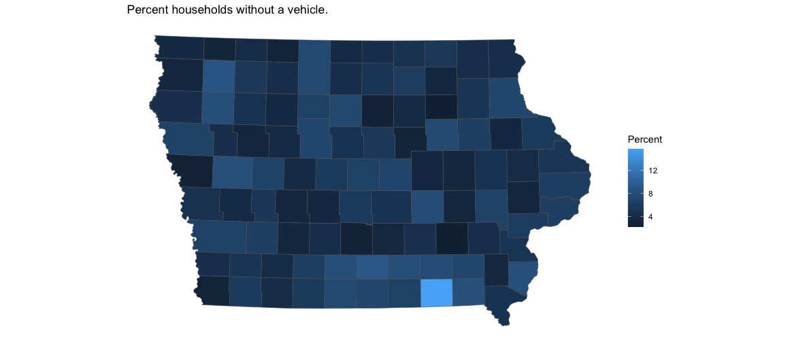

## Assignment 3

#### Map 1: Households no vehicle
Households without a vehicle. I used variables ... and then did a mutate

#### Map 2: something
The second map use ...

#### Map 3: something
The third map is of

